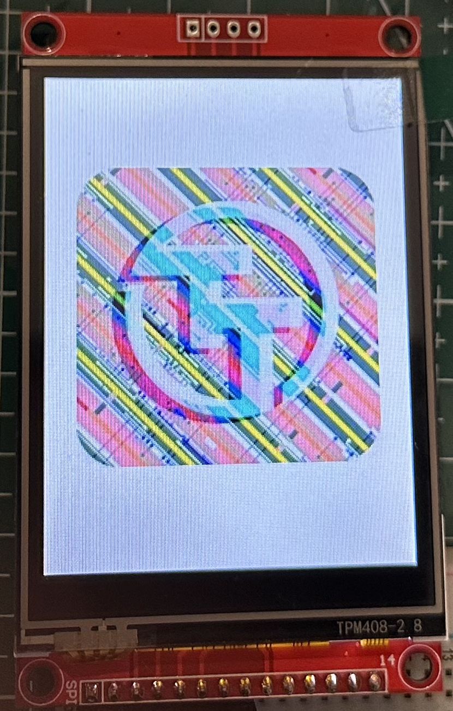

## How it works

**SotaSoC** is a compact RISC-V System-on-Chip (SoC) targeting [**Tiny Tapeout**](https://tinytapeout.com) tape-out and also capable of running on **Artix 7 FPGA** with Vivado. Suitable for custom boards, teaching, and as a base for your own SoC. Software support includes **FreeRTOS**, **MicroPython** (in development), and **bare-metal**.

### Supported ISA Extensions

- **I** — RV32I: 32-bit RISC-V base integer instruction set with 32 general-purpose registers.
- **C** — RISC-V Compressed instructions.
- **Zicsr** — Control and Status Register extension.
- **Zifencei** — Instruction-fetch fence extension.

### Peripherals

- **QSPI Flash** and **QSPI PSRAM** — 128 Mbit Flash for code and data, 64 Mbit PSRAM for runtime memory
- **UART** — programmable baud rate via 10-bit clock divider; default 115200 at 64 MHz
- **48-bit timer** (mtime)
- **13× GPIO** — 1 bidirectional (in/out), 6 input (with interrupt), 6 output
- **PWM** — 16-bit period and duty (in clock cycles), configurable frequency and duty cycle per channel
- **SPI** — master; full mode support (CPOL/CPHA), clock up to 16 MHz, configurable; 4-byte buffer
- **I2C** — master; clock configurable via 8-bit prescaler — 100 kHz, 400 kHz, 1 MHz, and others; START, STOP, repeated START, byte read/write with ACK/NACK

### Board Support Package (BSP)

A BSP is available for **FreeRTOS** and **bare-metal** development:

- FreeRTOS BSP: https://github.com/sotatek-dev/SotaSoC-BSP/tree/main/examples-freertos
- Bare-Metal BSP: https://github.com/sotatek-dev/SotaSoC-BSP/tree/main/examples-baremetal

### Demo

SotaSoC is capable of driving real-world applications such as a **320×240 ST7789 LCD** display at ~10 FPS via SPI at 16 MHz clock.

*The photo above was taken from a test on an Artix 7 FPGA; the tapeout chip is not yet available.*

More examples and demos are available in the SotaSoC-BSP (https://github.com/sotatek-dev/SotaSoC-BSP) repository.

For more detailed technical information, see https://github.com/sotatek-dev/SotaSoC.

## How to test

**Prerequisites for testing:**
- A **QSPI Pmod** is required.
- **System clock** is set to **32 MHz**.
- Pins **ui_in[5]** and **ui_in[6]** are **pulled down**. These two pins configure the read delay for QSPI data. When the system clock is above 32 MHz, try **ui_in[6:5]** in order—**00**, **01**, **10**, **11**—to see which value gives reliable operation. **Note:** This value is sampled only once, immediately after reset.

### Blink

This test verifies the basic functionality of the design by blinking an LED.

1. **Write firmware to Flash**

   Download the blink firmware: https://github.com/sotatek-dev/SotaSoC-BSP/blob/main/examples-baremetal/blink-tt/build/blink-tt.bin, then write it to Flash at address **0x0000_0000**.

2. **Connect two LEDs to the board**

   Connect two LEDs (each with a suitable series resistor): one to **uo_out[1]** and one to **uo_out[2]**.

3. **Reset and run**

   Reset the board. The LED connected to **uo_out[2]** will blink.
   
   If there is an error related to Flash and PSRAM, the LED connected to **uo_out[1]** will light up.

### ST7789 LCD test

This test verifies the ability to drive the ST7789 LCD via SPI. Follow the instructions below:

1. **Write firmware to Flash**

   Download the firmware from https://github.com/sotatek-dev/SotaSoC-BSP/blob/main/examples-baremetal/spi-st7789-tt/build/spi-st7789-tt.bin, then write it to Flash at address **0x0000_0000**.

2. **Wiring**

   Connect the LCD to the development board as follows:

   | LCD Pin     | Development Board Pin |
   | :---------- | :-------------------- |
   | VCC         | VCC                   |
   | GND         | GND                   |
   | CS          | uo_out[3]             |
   | SCK         | uo_out[4]             |
   | SDI (MOSI)  | uo_out[5]             |
   | DC          | uo_out[6]             |
   | RST         | uo_out[7]             |
   | LED         | VCC                   |

3. **Expected Result**

   After reset, you will see some content displayed on the LCD as shown in the figure below:

   

### Other examples

The https://github.com/sotatek-dev/SotaSoC-BSP repository provides other sample firmware (e.g. UART, PWM, I2C). You can download any of them and write the binary to flash at address **0x0000_0000** to run different demos or test other peripherals.

**Important note:** To test **I2C** or **GPIO[0]**, you need to **cut the PSRAM B trace on the QSPI Pmod**, because I2C and GPIO[0] are using pin **uio[7]**.

---

## External hardware

To test **blink**: you need a **[QSPI Pmod](https://github.com/mole99/qspi-pmod)** and **two LEDs** connected to **uo_out[2]** and **uo_out[1]** as described in How to test above.

To test **ST7789 LCD**: you need a **320×240 ST7789 LCD** (SPI). Connect it to the development board as described in the ST7789 LCD test section above.

To test **other peripherals** (UART, PWM, SPI, I2C, etc.), refer to the specific examples in the https://github.com/sotatek-dev/SotaSoC-BSP repository.
