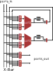

<!---

This file is used to generate your project datasheet. Please fill in the information below and delete any unused
sections.

You can also include images in this folder and reference them in the markdown. Each image must be less than
512 kb in size, and the combined size of all images must be less than 1 MB.
-->

## How it works

This project implements a tiny FPGA.
The design is essentially a crossbar which connects 8 Inputs, 8 LUTs and 4 output ports.
Because of the small size, I decided not to do any routing fabric besides the crossbar.

## How to test

**Important:** Tie `Virtual Reset` high before powering on the chip.

1. Tie the `Virtual Reset` pin high to ensure that you don't accidentally get a combinatorial loop on startup.
2. Power on the chip.
3. Load in a bitstream using the `Program Data` and `Program Enable` pins. The configuration is stored in a shift register, so you can load in the configuration one bit at a time.
4. Disable `Virtual Reset` and observe your design in action!

Some of examples of what might be possible:

- Simple combinatorial logic.
- Toggling an output.
- A 4-bit counter that counts from 0 to 15 and then wraps around.

See the testbench for examples.

## External hardware

No external hardware is required to run this project.
