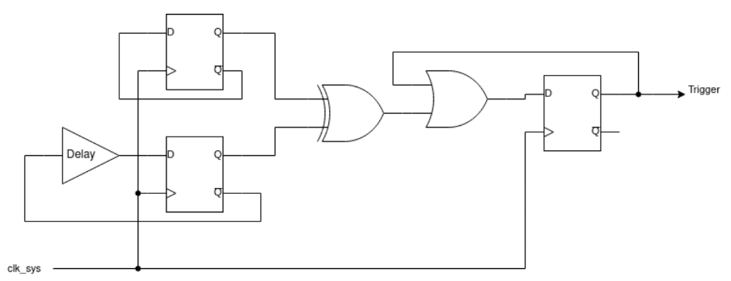

## How it works

This project is heavily inspired by the glitch detector security peripheral of the Raspberry RP2350 microcontroller. Thanks to the detailed description in the datasheet, I was inspired to create my own implementation of such a detector in the form of a Tiny Tapeout ASIC design.

The working principle of the detector is explained in the RP2350 datasheet, from which I am quoting here:
> The glitch detector detects loss of setup and hold margin in the system clock domain, which may be caused by deliberate external manipulation of the system clock or core supply voltage. [...]

> Two flops each toggle on every system clock cycle. One has a programmable delay line in its feedback path, the other does not. Loss of setup or hold margin causes one of the flops to fail to toggle, so the flops values differ, setting the trigger output

> The detector triggers when the two D-flops take on different values, which is impossible under normal circumstances. The delay line is programmable from 75% to 120% of the minimum system clock period in increments of 15%. Higher delays make the circuit more sensitive to loss of setup margin. [...]

## How to test

To perform a fault injection attack and test the detector circuit on this chip, an appropriate external tool is required. The choice of tool depends on the type of fault injection to be performed. For supply voltage glitching, the ChipWhisperer-Lite or -Pro could be used, for clock glitching the ChipWhisperer-Pro is recommended. For electromagnetic fault injection (EMFI), the ChipSHOUTER or ChipSHOUTER-PicoEMP might be suitable. There are other commercial and open source options and of course you can always build your own customized fault injection tools.

With the exception of EMFI attacks, performing fault injection attacks will usually require modifications to the power rails or clock circuitry of the Tiny Tapeout breakout board. Modifying the PCB or performing fault injection attacks in general risks interfering with or even permanently damaging the ASIC or other circuitry on the board. This is an untested experimental design, fault injection attacks might not just trigger the detector but also glitch the design multiplexer on the ASIC, requiring the chip to be reset. Every modification, experiment or attack is your own responsibility and I won't be liable for any damage.

## External hardware

- Fault injection tool of your choice (e.g. ChipWhisperer or ChipSHOUTER) to perform the glitching attacks
- Octal LED PMOD (e.g. 8LD) connected to the Out-Port to show the status of the detectors