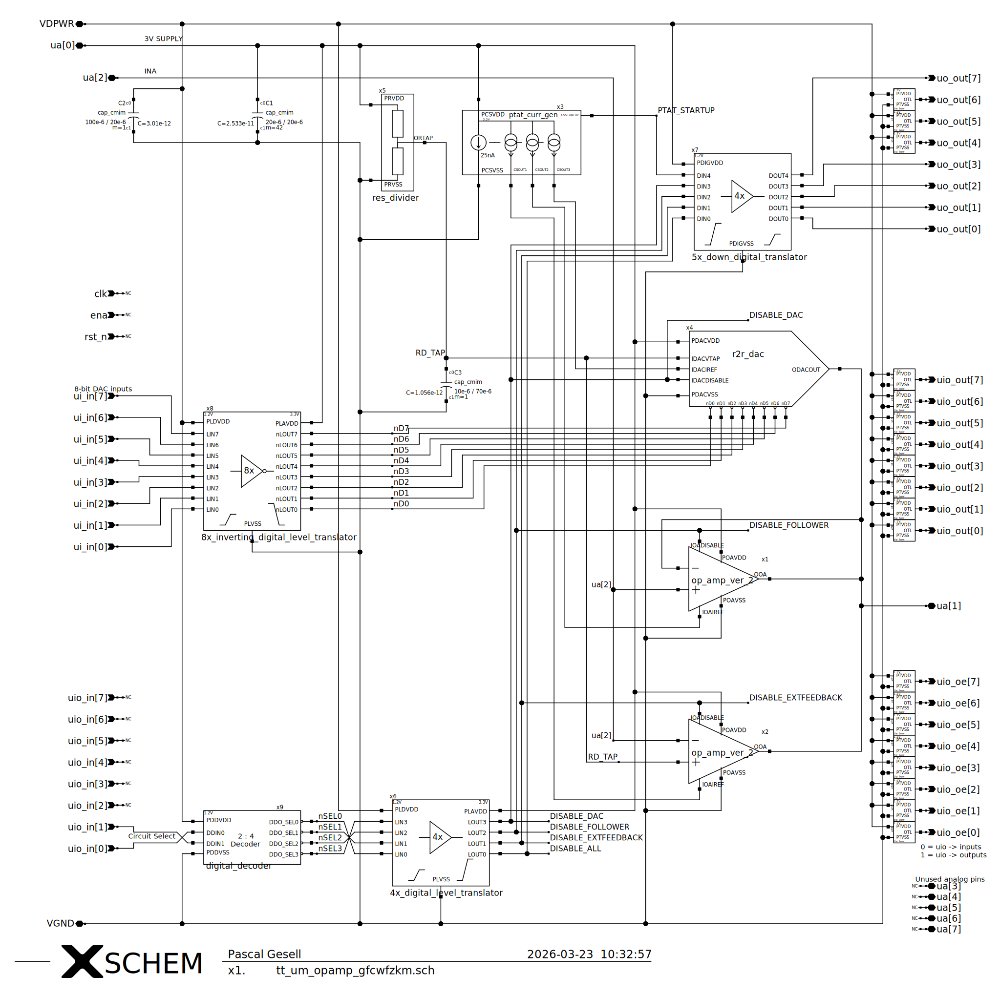
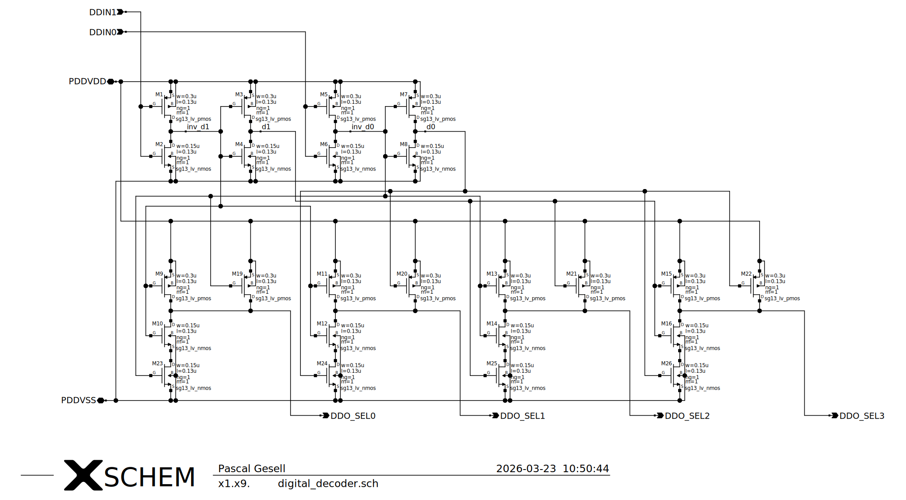
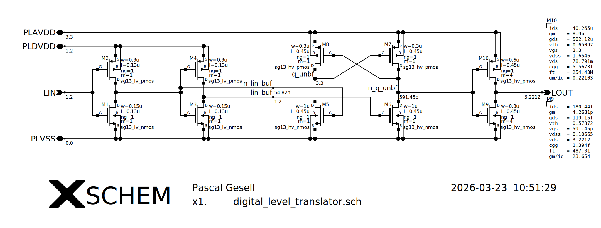
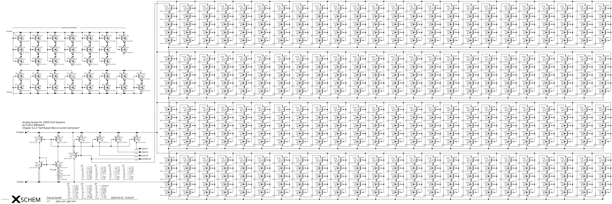
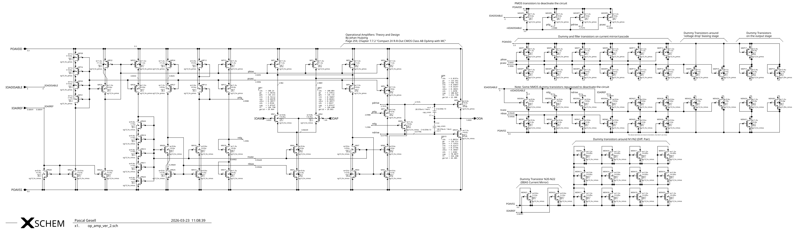
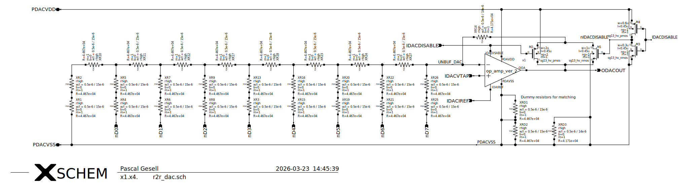
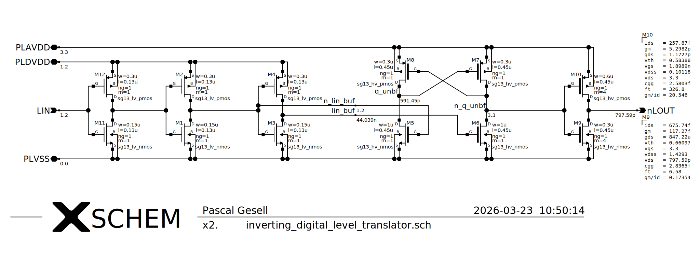

<!---

This file is used to generate your project datasheet. Please fill in the information below and delete any unused
sections.

You can also include images in this folder and reference them in the markdown. Each image must be less than
512 kb in size, and the combined size of all images must be less than 1 MB.
-->

The goal of this analogue circuit project was to design a low-power operational amplifier (op-amp) using only open-source EDA tools targeting the IHP SG13G2 OpenPDK and to measure its performance using three test circuits: an inverting opamp circuit with to be connected external feedback, a voltage follower circuit, and an R2R Digital-to-Analogue Converter (DAC).

## How it works

The above schematic shows the Tiny Tapeout analogue tile, containing the three operational amplifier (op-amp) circuits and the auxiliary circuits. The three operational amplifier circuits are configured as a simple inverting amplifier with external feedback, a voltage follower and an R2R DAC. The auxiliary circuits include a Proportional to Absolute Temperature (PTAT) current source for biasing the analogue circuits, a resistor divider, digital level shifters and a 2-to-4 decoder.

Next to the standard digital I/Os, provided by the Tiny Tapeout template, the tile includes three analogue pins `ua[0]` to `ua[2]`. The pin `ua[0]` is used as a 3.3 V power supply input for the analogue circuit, due to the lack of an 3.3 V supply rail on this shuttle (TTIHP26a). The pin `ua[1]` is used as the output of the three op-amp circuits, which are connected together. The pin `ua[2]` is used as an input for the inverting amplifier and the voltage follower circuit. It is not used for the R2R DAC circuit. Due to the limited number of analogue pins, an internal resistor divider is used to create a reference voltage of 1.65 V, which is used as the 'virtual ground' for the inverting amplifier and the R2R DAC.

### Circuit selection

All three op-amp circuits share the same op-amp design and their outputs are connected to the same output pin `ua[1]`. Using the digital input pins `uio_in[1]` and `uio_in[0]`, the user can select which of the three operational amplifier circuits to test. The decoded, active-low output of the 2-to-4 decoder is available on the output pins `uo_out[0]` to `uo_out[3]` and can be used to view which circuits are disabled. The following table shows the decoding of the input signals to select the circuit to test:

| `uio_in[1]` | `uio_in[0]` | Description                                           |
| ------------- | ------------- | ----------------------------------------------------- |
| 0             | 0             | All op-amps disabled, output `ua[1]` high-impedance |
| 0             | 1             | External feedback op-amp active                       |
| 1             | 0             | Voltage follower active                               |
| 1             | 1             | R2R DAC active                                        |

To safe space and due to some LVS problems with the standard cell library, the 2-to-4 decoder is implemented directly using 1.2 V transistors.

The decoded 1.2 V signals are then level-shifted to 3.3 V using a simple, non-inverting level shifter design.

### PTAT current source

The PTAT current source is used to provide a stable current source, containing three current mirror outputs with a target current of approx. 25 nA. The PTAT current source includes a start-up circuit to ensure that the current source starts up correctly and does not get stuck in a zero-current state.

While the core circuit of the PTAT current source is quite compact, the start-up circuit takes up a lot of space due to the voltage drop required to operate the start-up circuit and due to the small current targeted by the PTAT current source. Thus, the start-up circuit alone requires 480 transistors configured at the minimal width and maximal length allowed by the PDK (w=0.3µm, l=10µm) to achieve the required voltage drop and to minimize the current consumption of the start-up circuit.

The circuit not only contains the three mirrored current outputs, but also a start-up signal output, which is used to indicate a successful start-up of the current source (active-high). The start-up signal is available on the output pin `uo_out[7]` and can be used to check if the current source has started up correctly.

### Op-amp design

The design of the operational amplifier is based on a simple two-stage, low-power design. The first stage is a differential pair with a current mirror load, while the second stage is a rail-to-rail output stage. The circuit is designed to operate at a supply voltage of 3.3 V with a bias current of 25 nA, which is provided by the PTAT current source. In addition to the typical op-amp pins (current-bias input, non-inverting input, inverting input and output), the op-amp also includes a disable pin (active-high), which is used to disable the internal op-amp circuit and to put the output in a high-impedance state.

The process corner simulations of the designed op-amp in the voltage follower configuration show unity gain up to 339 kHz in the worst case with a test load of 10 MΩ and 50 pF. Note that these preliminary simulation results were done with the schematic excluding any extracted parasitics.

### R2R DAC design

The 8-bit R2R DAC is designed using a simple resistor ladder structure, with the 8-bit input directly connected to the resistor ladder. The R2R DAC is designed to operate at a supply voltage of 3.3 V and to provide an output voltage range close to the supply range. An inverting operational amplifier circuit is used as a buffer stage. Thus, the input bits of the R2R DAC circuit itself are active-low (while the binary value is set via the active-high input ui_in[7:0]). The amplification of the op-amp is set to 0.933 to ensure that the output voltage is within the optimal range of the op-amps output stage. To correctly disable the circuit when the R2R DAC is not selected, an additional transmission gate disconnects the feedback path of the output, as the R2R resistor ladder would otherwise still load the analogue output pin and affect the performance of the other op-amp test circuits when they are selected.

Since the R2R DAC does not contain any additional buffers/drivers at the input stage and requires 3.3 V logic levels, the parallel input `ui_in[7:0]` of the Tiny Tapeout tile are inverted and shifted up by the logic level shifter, before being fed into the R2R DAC circuit. The output buffer stage of the logic level shifter is designed to provide a strong drive strength to ensure the correct operation of the R2R DAC circuit.

*Note: Some images are shown as PNGs instead of SVGs due to the large size of some SVG files and the 1 MB size limit of the Tiny Tapeout project datasheet. The original SVG files can be found in the [xschem/svg](../xschem/svg) directory.*

## Simulation results

All designed circuits come with a ngspice/xschem test bench in the [xschem](../xschem) directory using the [IIC-OSIC-TOOLS docker image](https://github.com/iic-jku/IIC-OSIC-TOOLS):

- **tb_op_amp.sch** - Operational amplifier test bench
- **tb_r2r_dac.sch** - R2R DAC test bench
- **tb_ptat_curr_gen.sch** - PTAT current source test bench
- **tb_ptat_opamp_startup.sch** - PTAT op-amp startup test bench
- **tb_digital_decoder.sch** - 2-to-4 decoder test bench
- **tb_digital_level_translator.sch** - Level shifter test bench
- **tb_res_divider.sch** - Resistor divider test bench
- **tb_tie_low.sch** - Tie low test bench
- **tb_tt_um_opamp_gfcwfzkm.sch** - Full Tiny Tapeout op-amp tile test bench

## How to test

See the [info.yaml file](../info.yaml) for the pinout and connect the required test equipment to the right pins. For the input and bidirectional input port of the [TinyTapeout Demo Board](https://github.com/TinyTapeout/tt-demo-pcb), you can connect a basic DIP switch Pmod (e.g., the [1BitSquared PMOD DIP Switch](https://docs.icebreaker-fpga.org/hardware/pmod/dip-switch/)) to set the DAC input bits and to select the circuit to test. For the digital output pins, connect a simple LED Pmod (e.g., the [Digilent Pmod 8LD](https://digilent.com/reference/pmod/pmod8ld/start)) to visualize the currently disabled circuits and the start-up status of the PTAT current source.

For the analogue output pins, you must provide a 3.3 V power supply to the internal analogue circuit using the pin `ua[0]`. The output of the op-amp circuits can be measured on the pin `ua[1]` using an oscilloscope or a multimeter. To test the non-inverting amplifier and the voltage follower circuit, you can provide an input signal to the pin `ua[2]` using a function generator. Note that the analogue input pin is not in use if the R2R DAC circuit is selected.

## External hardware

To test and use this project, you will need the following hardware:

- [2 × 1BitSquared PMOD DIP Switch](https://docs.icebreaker-fpga.org/hardware/pmod/dip-switch/) : A 8-bit DIP switch Pmod
- [1 × Digilent Pmod 8LD](https://digilent.com/reference/pmod/pmod8ld/start) : A 8 LED Pmod
- A 3.3 V power supply to power the analogue test circuits
- A function generator to provide input signals for the inverting amplifier and the voltage follower circuit
- An oscilloscope or a multimeter to measure the output of the op-amp circuits
