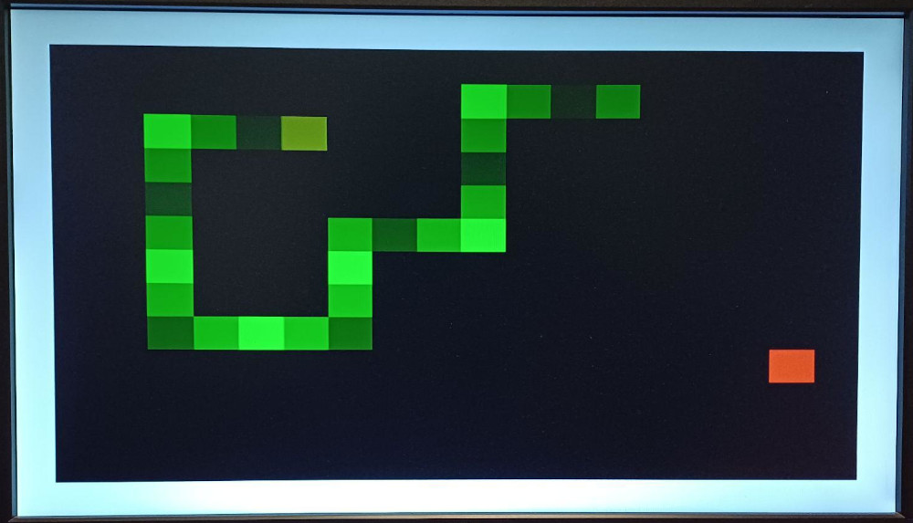

<!---

This file is used to generate your project datasheet. Please fill in the information below and delete any unused
sections.

You can also include images in this folder and reference them in the markdown. Each image must be less than
512 kb in size, and the combined size of all images must be less than 1 MB.
-->

# TT Snake Game

## How it works

Snake is a simple video game where the player controls a snake.
The goal is to eat food while preventing the snake from biting itself or moving into the walls.
Every time the snake eats food it gets a bit longer, increasing the difficulty.

The game is won if the snake fills the entire area.

The current state of the game is displayed on a VGA monitor and the player can control the snake using four buttons.

## How to test

The clock input frequency must be set to the VGA frequency of `25,175,000 Hz`.

Connect the VGA PMOD to the output pins.

function | uo_out    | polarity
---------|-----------|--------------------------------
R1       | uo_out[0] |
G1       | uo_out[1] |
B1       | uo_out[2] |
VSync    | uo_out[3] | 0 during image, 1 during pulse
R0       | uo_out[4] |
G0       | uo_out[5] |
B0       | uo_out[6] |
HSync    | uo_out[7] | 0 during image, 1 during pulse

Connect the control buttons to the input pins as follows.

function | ui_in    | optional?
---------|----------|-----------
up       | ui_in[0] | no
down     | ui_in[1] | no
left     | ui_in[2] | no
right    | ui_in[3] | no
pause    | ui_in[4] | yes (if 0)
restart  | ui_in[5] | yes (if 0)

The game starts once the button of a valid input direction has been pressed.

The game speed can be changed by pressing up/down while asserting restart.
It is linked to the VGA display refresh rate with a controllable factor (1-32), which slows down the game speed accordingly.
Default is 15, which results in 4 updates per second.

Colorblind mode can be enabled by pressing right while asserting restart.
This swaps the green and blue color channel, resulting in a blue snake.

Additionally, the game exposes three signals about the game state that could be used to e.g. add external sound effects.

function | uio_out    | duration
---------|------------|-----------------
failure  | uio_out[0] | until restart
success  | uio_out[1] | until restart
eat      | uio_out[2] | one clock cycle

## External hardware

Playing the game requires the VGA PMOD, four buttons for movement controls and two optional buttons for pause and restart.
