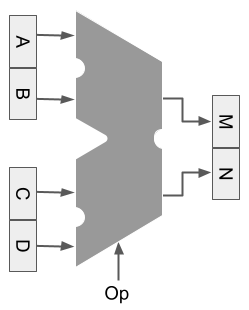

<!---

This file is used to generate your project datasheet. Please fill in the information below and delete any unused
sections.

You can also include images in this folder and reference them in the markdown. Each image must be less than
512 kb in size, and the combined size of all images must be less than 1 MB.
-->

# TeenySPU on TinyTapeout Technical Docs

3.22.26 (Eric Shook, Logan Gall)

We developed a TeenySPU for the TinyTapeout architecture. TinyTapeout includes 8-bit input (INP), 8-bit output (OUT), and 8-bit input/output-swappable (UIO). The TeenySPU is a 4-bit architecture, so the 8-bit INP, OUT, and UIO are split into two 4-bit sections, high and low. The high 4-bits of INP provide the 4-bit opcode, the low 4-bits of INP control a Q MUX to select how input data from UIO is routed to inputs A, B, C, and D. The 4-bit outputs M and N are routed to OUT high and OUT low, respectively. For more details on the TinyTapeout specs, see: https://tinytapeout.com/specs

## Hardware Structure

TinySPU is structured to function within the limitations of the TinyTapeout project spec. In general, this means:

* ~50MHz Clock rate
* 8 bits of Input (designated to OpCode & QMux)
* 8 bits of Output (designated to M and N outputs)
* 8 bits of UIO (designated to ABCD inputs)

## How it works

The TeenySPU uses a spatial instruction set architecture (SISA), which is split into two sections:
* Operation Codes -- The operation selection for the TeenySPU chip, set as the high 4 bits of Input
* Q Mux Codes -- The data loading multiplexer code, set as the low 4 bits of Input

## Spatial Instruction Set Architecture (SISA)

Spatial instructions are organized into categories to demonstrate the breadth of spatial operations available for a prototypical SPU.

### Opcode categories

| Opcode | Category |
|--------|-----------------|
| `00xx` | Control SPU Ops |
| `01xx` | 4-bit Vector Ops |
| `10xx` | 4-bit Raster Ops |
| `110x` | 4-bit Multispec Raster Ops |
| `111x` | 8-bit Double-precision Ops |

### 16 TeenySPU Opcodes

The following 16 spatial opcodes can be used to create a multitude of spatial methods. Details of each op are included below.

| Opcode | Mnemonic | Category |
|--------|---------|-----------|
| `0000` | NOP | Control SPU Ops |
| `0001` | MinGate | Control SPU Ops |
| `0010` | EqGate | Control SPU Ops |
| `0011` | ZeroMN | Control SPU Ops |
| `0100` | DistDir | 4-bit Vector Ops |
| `0101` | BoxArea | 4-bit Vector Ops |
| `0110` | BasicBuffer | 4-bit Vector Ops |
| `0111` | AttrReclass | 4-bit Vector Ops |
| `1000` | FocalMeanRow | 4-bit Raster Ops |
| `1001` | FocalSumRow | 4-bit Raster Ops |
| `1010` | LocalDiv | 4-bit Raster Ops |
| `1011` | FocalMaxPoolRow | 4-bit Raster Ops |
| `1100` | NormDiffIndex | 4-bit Multispec Raster Ops |
| `1101` | LocalCodeOp | 4-bit Multispec Raster Ops |
| `1110` | DoubleDist | 8-bit Double-Precision OUT Ops |
| `1111` | DotProduct | 8-bit Double-Precision OUT Ops |

To find more documentation and examples, look at the repository documentation: [https://github.com/umn-geocommons](https://github.com/umn-geocommons/tt_um_teenyspu). 

## How to test

The Verilog code can be run in the HDL software of your choice, with src/tt_um_teenyspu.v as the top-level module.

File test/tb_tt_um_teenyspu.v contains a testbench of all operations programmed for the TeenySPU. This can be set as a simulation source.

## External hardware

List external hardware used in your project (e.g. PMOD, LED display, etc), if any
